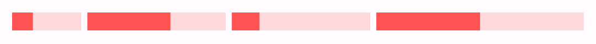
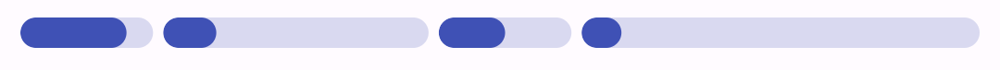
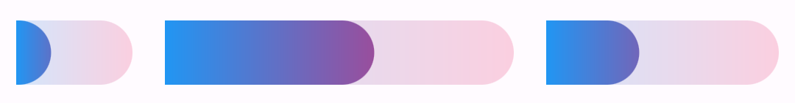
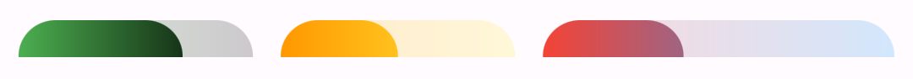
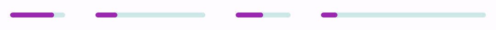
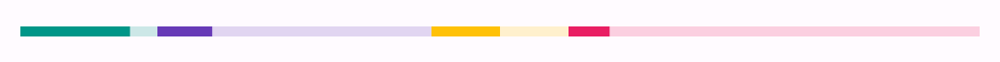

# ⋯ Segmented Progress Bar
Create highly customizable progress bars that show progression across multiple stages of a task. It can be also used to show progression of multiple tasks simultaneously.


## 🚀 Features and Customizations
- Offers two variants of the segmented progress bar with types- Linear and Circular
- Modify the look and feel of the progress bars by changing their thickness, spacing, border radius and colors
- The colors can be a single or custom color for each segment along with an optional background color
- Prefer to use a gradient instead? This has got you covered! Specify common or individual gradients for all the segments as you wish just like with color customizations.
- All the properties are implicitly animated so it can smoothly transition between them. Tailor the feel of the animation by specifying the duration and curve. ~~Sky~~ Creativity is the limit 

## 🧭 Usage

Use the widget like you would normally use for the vanilla progress indicators with a slight modification.

```dart
SegmentedProgressBar(
    segments: [1, 2, 1],
    progress: [0.6, 0, 0],
    colors: [
        Colors.indigo,
        Colors.amber,
        Colors.green,
    ],
)
```

### Example 1

```dart
SegmentedProgressBar(
    segments: const [1, 2, 2, 3],
    values: const [0.3, 0.6, 0.2, 0.5],
    color: Colors.redAccent,
    radius: BorderRadius.zero,
)
```

### Example 2

```dart
SegmentedProgressBar(
    segments: const [1, 2, 1, 3],
    values: const [0.8, 0.2, 0.5, 0.1],
    color: Colors.indigo,
)
```
### Example 3

```dart
SegmentedProgressBar(
    segments: const [1, 2, 4, 1, 3],
    values: const [0.3, 0.2, 0.6, 0.7, 0.5],
    color: Colors.black,
    spacing: 0,
    insideRadius: BorderRadius.zero,
)
```
### Example 4

```dart
SegmentedProgressBar(
    segments: const [1, 3, 2],
    values: const [0.3, 0.6, 0.4],
    gradient: const LinearGradient(colors: [Colors.blue, Colors.pink]),
    thickness: 32,
    spacing: 16,
    radius: const BorderRadius.horizontal(right: Radius.circular(20)),
)
```
### Example 5

```dart
SegmentedProgressBar(
    segments: const [2, 2, 3],
    values: const [0.7, 0.5, 0.4],
    gradients: const [
        LinearGradient(colors: [Colors.green, Colors.black]),
        LinearGradient(colors: [Colors.orange, Colors.yellow]),
        LinearGradient(colors: [Colors.red, Colors.blue]),
    ],
    thickness: 16,
    spacing: 12,
    radius: const BorderRadius.only(
        topLeft: Radius.circular(20),
        topRight: Radius.circular(20),
    ),
)
```
### Example 6

```dart
SegmentedProgressBar(
    segments: const [1, 2, 1, 3],
    values: const [0.8, 0.2, 0.5, 0.1],
    color: Colors.purple,
    backgroundColor: Colors.teal,
    thickness: 4,
    spacing: 24,
)
```
### Example 7

```dart
SegmentedProgressBar(
    segments: const [1, 2, 1, 3],
    values: const [0.8, 0.2, 0.5, 0.1],
    colors: const [
        Colors.teal,
        Colors.deepPurple,
        Colors.amber,
        Colors.pink,
    ],
    thickness: 4,
    spacing: 0,
    radius: BorderRadius.zero,
)
```

### __*Circular Progress Bar Examples coming soon*__

## 🗒️ Todo

- [ ] Add vertical linear progress bar
- [ ] Make the number of segments animatable
- [ ] Auto center active segment
- [ ] Add a widget to the progress head
- [ ] Include more variants (possibly a squiglly line?)
